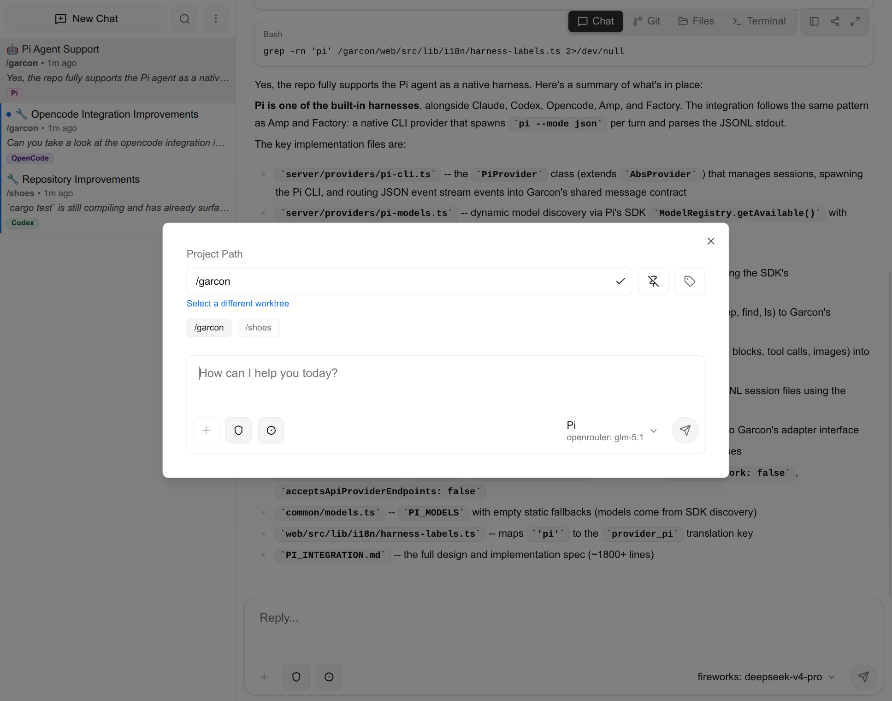
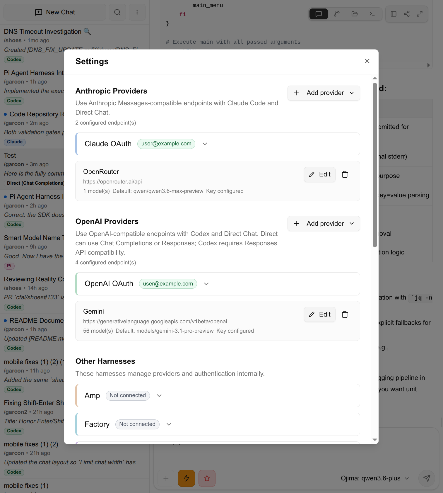

<h1 align="center">Garcon</h1>

<p align="center"><strong>Garcon is a unified coding workspace for AI coding agents - use it from your phone or computer, with seamless access to your local machine.</strong></p>

<p align="center">Works with Claude Code, Codex, Cursor Agent, OpenCode, Amp, Factory Droid, Pi, and OpenAI/Anthropic-compatible endpoints.</p>

<p align="center">
  
</p>

<table>
  <tr>
    <td align="center">
      <a href="screenshots/main-screen-dark.png">
        
      </a>
    </td>
    <td align="center">
      <a href="screenshots/git-screen.png">
        
      </a>
    </td>
    <td align="center">
      <a href="screenshots/main-screen-mobile.png">
        
      </a>
    </td>
    <td align="center">
      <a href="screenshots/main-screen-light.png">
        
      </a>
    </td>
  </tr>
  <tr>
    <td align="center"><em>Main workspace</em></td>
    <td align="center"><em>Git workbench</em></td>
    <td align="center"><em>Mobile layout</em></td>
    <td align="center"><em>Settings screen</em></td>
  </tr>
</table>

## What It Does

- Runs persistent coding sessions across Claude Code, Codex, Cursor Agent, OpenCode, Amp, Factory, Pi, and direct API-backed agents.
- Sessions are shared with the CLI, so you can switch between Garcon and the terminal at any time.
- Supports Anthropic Messages, OpenAI Chat Completions, OpenAI Responses, Ollama, OpenRouter, Gemini, Fireworks, Together, Alibaba Cloud, Z.AI, and custom endpoints.
- Codex uses `codex app-server` for live turns, history, approvals, and forks.
- Per-session controls for model, permissions, thinking, images, tags, queue, read state, pin, archive, reorder, fork, and share.
- Unified workspace for your entire dev flow, with a file browser, editor, terminal, and Git workbench.
- Git workbench with status, split diffs, line/hunk/file staging, commits, branches, remotes, push/pull/fetch, worktrees, and revert/reset.
- Split panes with drag-and-drop and resizable layouts, up to four visible sessions.
- Saved searches, sidebar filters, quick search pills, tags, and unread/active filters.

## Requirements

- [Bun](https://bun.sh/) and `git`
- At least one working agent or API provider:
  - Claude Code: Claude subscription, `ANTHROPIC_API_KEY`, or an Anthropic-compatible endpoint
  - Codex: ChatGPT subscription, `OPENAI_API_KEY`, or an OpenAI-compatible endpoint
  - Cursor Agent CLI/login or `CURSOR_API_KEY`
  - OpenCode config
  - Amp CLI/login
  - Factory Droid CLI/login or `FACTORY_API_KEY`
  - Pi CLI/config
  - Ollama or another configured API provider

## Quick Start

```bash
git clone https://github.com/cfal/garcon.git
cd garcon
bun run install
bun run start
```

Default URL: `http://127.0.0.1:8080`. On first launch, create an account at
`/setup`, then configure agents and API providers in Settings. To skip local auth:

```bash
bun run start --disable-auth
# or
GARCON_DISABLE_AUTH=true bun run start
```

## Run And Configure

```bash
bun run start --port 8080 --bind-address 127.0.0.1 --project-base-dir /path/to/repos
```

Useful options and environment variables:

- `GARCON_PORT` / `--port`: listen port. Use `0` for a random port.
- `GARCON_BIND_ADDRESS` / `--bind-address`: server bind address.
- `GARCON_CONFIG_DIR` / `--config-dir`: base config directory. Defaults to `~/.garcon`.
- `GARCON_WORKSPACE` / `--workspace`: named workspace under the config dir.
- `GARCON_WORKSPACE_DIR` / `--workspace-dir`: explicit workspace directory.
- `GARCON_PROJECT_BASE_DIR` / `--project-base-dir`: filesystem access boundary.
- `GARCON_TERMINAL_SHELL`: shell used by PTY sessions.
- `CLAUDE_BINARY`, `AMP_BINARY`, `FACTORY_BINARY`: override CLI binary paths.
- `GARCON_CODEX_CLI`: override the Codex CLI used for app-server.
- `GARCON_CURSOR_BINARY`: override the Cursor Agent CLI binary path.
- `CURSOR_API_KEY`: Cursor Agent API key for native Cursor sessions.
- `GARCON_PI_BINARY` / `PI_BINARY`: override the Pi CLI binary path.
- `PI_CODING_AGENT_SESSION_DIR`: optional Pi session directory override.

Telegram notifications are configured from the server settings UI.

Run `bun run help` for the full option list.

Security-sensitive deployment notes live in [`docs/security.md`](docs/security.md).

## Agents And Models

Configure agents and API providers from Settings. Agents execute chats; API
providers are managed endpoints that compatible agents and direct runners can
use. API keys are stored server-side and redacted from client responses. Local
Ollama is supported via API provider templates and model discovery.

Direct runners are available for OpenAI Chat Completions, OpenAI Responses, and
Anthropic Messages endpoints. Pi and Cursor are native-only agents that use
their own CLI/session stores.

## Build

```bash
bun run build      # SvelteKit frontend
bun run build-exe  # standalone Bun executable
```

`build-exe` runs checks/tests, builds `web/build`, compiles target-specific
executables under `dist/`, and runs a smoke test.

## Docker

Docker Hub images are published periodically but may lag behind latest commits.
Build locally for the freshest image:

```bash
GARCON_PROJECT_DIR=~/repos docker compose up -d --build
```

Or run a published image:

```bash
docker run -d \
  --name garcon \
  --init \
  --restart unless-stopped \
  -p 8080:8080 \
  -e GARCON_PORT=8080 \
  -e GARCON_BIND_ADDRESS=0.0.0.0 \
  -e GARCON_PROJECT_BASE_DIR=/projects \
  -e OPENAI_API_KEY="${OPENAI_API_KEY:-}" \
  -e CURSOR_API_KEY="${CURSOR_API_KEY:-}" \
  -v garcon-data:/home/garcon/.garcon \
  -v "$HOME/repos":/projects \
  -v "$HOME/.claude":/home/garcon/.claude \
  -v "$HOME/.codex":/home/garcon/.codex \
  -v "$HOME/.cursor":/home/garcon/.cursor \
  -v "$HOME/.opencode":/home/garcon/.opencode \
  -v "$HOME/.opencode/opencode-data":/home/garcon/.local/share/opencode \
  -v "$HOME/.opencode/opencode-state":/home/garcon/.local/state/opencode \
  -v "$HOME/.opencode/opencode-cache":/home/garcon/.local/cache/opencode \
  -v "$HOME/.amp":/home/garcon/.amp \
  -v "$HOME/.pi":/home/garcon/.pi \
  garconide/garcon:latest
```

Set `GARCON_PROJECT_DIR` for Compose or mount `/projects` for `docker run`.
Workspace data persists in `garcon-data`. Mount the auth/config directory for
each native CLI agent you use.

## Architecture

- `web/`: SvelteKit/Svelte 5 frontend.
- `server/`: Bun HTTP/WebSocket server, agents, API providers, queueing, Git, auth, and notifications.
- `common/`: shared chat, WebSocket, agent, provider, model, settings, and API contracts.

## Development

```bash
bun run check
bun run test
timeout 45s bun run start --port 0  # startup smoke test
```
