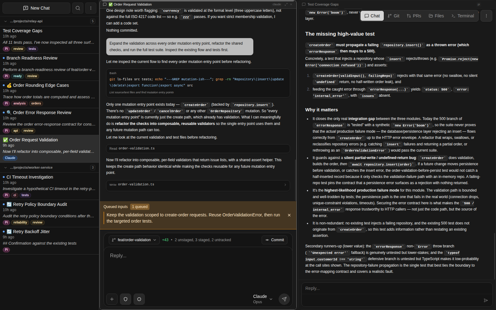
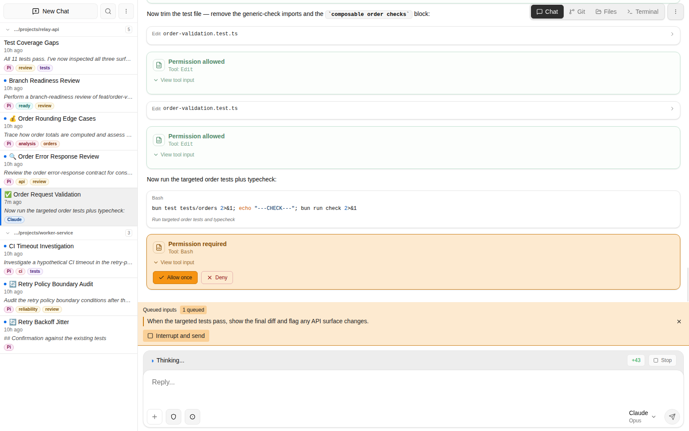
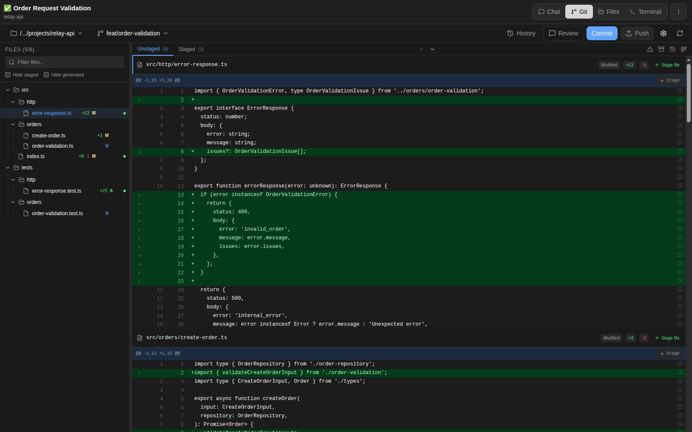
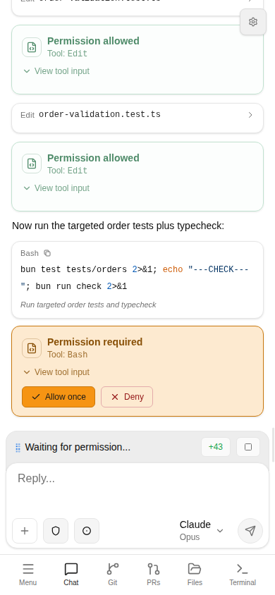

<h1 align="center">Garcon</h1>

<p align="center"><strong>Run the agents. Steer the work. Ship the change.</strong></p>

<p align="center">
  Garcon is a self-hosted browser workspace for Claude Code, Codex, Cursor Agent, OpenCode, Amp, Factory Droid, Pi, and your own model endpoints. Keep parallel sessions visible, redirect work while it runs, inspect the real files and diffs, turn pull request feedback into agent tasks, and ship from your computer or phone.
</p>

<p align="center">
  <a href="#why-garcon">Why Garcon</a> &middot;
  <a href="#see-it-in-action">See it in action</a> &middot;
  <a href="#works-with">Works with</a> &middot;
  <a href="#quick-start">Quick Start</a>
</p>

<p align="center">
  <a href="screenshots/readme-parallel-agents-dark.png">
    
  </a>
</p>

<p align="center"><em>Different agents, different tasks, one workspace.</em></p>

Garcon runs on the machine that has your code and uses the agent logins and model endpoints you configure. Agent, terminal, file, and Git operations execute on the Garcon host.

## Why Garcon

The terminal is excellent for one focused agent session. It gets harder when several agents are working, one needs approval, another has finished, and the resulting change still needs review. Generic chat interfaces improve visibility but usually stop before the project files, terminal, Git history, and pull request.

Garcon keeps that entire workflow together:

- **Run work in parallel.** Keep up to four live sessions in resizable split panes, drag chats into place, and see which agents are active, unread, or waiting for you.
- **Steer without waiting.** Queue the next instruction while an agent is busy, interrupt and redirect the current turn, approve tool use, and answer agent questions in place. Codex sessions can also steer an active turn directly.
- **Change approach without losing context.** Continue a conversation under another agent or model, fork supported sessions from the full history or an exact message, and compare alternatives side by side.
- **Review the work, not just the summary.** Browse and edit project files, open a terminal, inspect rendered reasoning and tool calls, review large diffs, and stage individual lines, hunks, files, or folders.
- **Close the loop.** Read GitHub pull requests and review threads, send a PR or individual comment to the active agent, generate commit messages, commit and push, and manage branches, worktrees, history, and reverts.
- **Keep the workload usable.** Search and organize chats by project, save filters, tag, pin, rename, reorder, archive, and track what needs attention. Share read-only transcripts and schedule one-off or recurring prompts into new or existing chats.
- **Step away without going blind.** Use the installable workspace from a phone and receive optional Telegram alerts when work completes, fails, or needs permission.

## See It In Action

<p align="center"><strong>Steer work while it is still running</strong></p>

<p align="center">
  <a href="screenshots/readme-agent-steering.png">
    
  </a>
</p>

<p align="center">Queue the next instruction for later, or interrupt and send it immediately when the plan changes.</p>

<table>
  <tr>
    <td width="70%" align="center">
      <a href="screenshots/readme-git-review.png">
        
      </a>
    </td>
    <td width="30%" align="center">
      <a href="screenshots/readme-mobile-workspace.png">
        
      </a>
    </td>
  </tr>
  <tr>
    <td align="center">
      <strong>Review and ship</strong><br />
      Inspect the real diff, stage the lines you want, commit, and push.
    </td>
    <td align="center">
      <strong>Unblock work from anywhere</strong><br />
      Approve a blocked step or reply without going back to your desk.
    </td>
  </tr>
</table>

### Built For Agent Work

- Attach images, Markdown, text, and PDF documents, or mention project files with `@` autocomplete.
- Read code, Markdown, images, diagrams, agent reasoning, tool calls, and file edits in purpose-built views instead of raw terminal output.
- Follow Codex subagents from one status bar, and use slash-command autocomplete for agent commands, session forks, context compaction, and Codex goals.
- Share a secure, read-only transcript with a teammate or another agent, then revoke it when the work is finished.

## Works With

**Coding agents:** Claude Code, Codex, Cursor Agent, OpenCode, Amp, Factory Droid, and Pi.

**Direct model access:** Anthropic Messages, OpenAI Responses, and OpenAI Chat Completions compatible endpoints.

**Provider presets and discovery:** Ollama, OpenRouter, Gemini, Fireworks, Together, Alibaba Cloud, Z.AI, and custom OpenAI or Anthropic compatible services.

Use an existing agent login or subscription where its CLI supports one, or configure API providers in Settings. Each chat keeps its own agent, model, effort, and permission settings where supported.

For CLI-backed agents, Garcon preserves the agent's native history where supported so existing work is not trapped in a separate inbox. Direct API-backed chats live in Garcon and do not have a corresponding CLI session.

## Quick Start

```bash
git clone https://github.com/cfal/garcon.git
cd garcon
bun run install
bun run start
```

Open `http://127.0.0.1:8080`. On first launch, create an account at `/setup`, then connect agents and API providers in Settings.

`bun run install` installs the server, web, and integration-test dependencies. Authentication is enabled by default.

### Requirements

- [Bun](https://bun.sh/) and `git`.
- A modern browser: Chrome/Edge 116+, Firefox 124+, or Safari/iOS Safari 17.4+.
- At least one working coding agent or API provider.
- Optional pull request support: an authenticated GitHub CLI on the Garcon host (`gh auth login`, `GH_TOKEN`, or `GITHUB_TOKEN`). The Pull Requests tab stays hidden when `gh` is unavailable.

## Run And Configure

```bash
bun run start --port 8080 --bind-address 127.0.0.1 --project-base-dir /path/to/repos
```

Useful options and environment variables:

- `GARCON_PORT` / `--port`: listen port. Use `0` for a random port.
- `GARCON_BIND_ADDRESS` / `--bind-address`: server bind address.
- `GARCON_CONFIG_DIR` / `--config-dir`: base config directory. Defaults to `~/.garcon`.
- `GARCON_WORKSPACE` / `--workspace`: named workspace under the config directory.
- `GARCON_WORKSPACE_DIR` / `--workspace-dir`: explicit workspace directory.
- `GARCON_PROJECT_BASE_DIR` / `--project-base-dir`: filesystem access boundary.
- `GARCON_TERMINAL_SHELL`: shell used by terminal sessions.
- `CLAUDE_BINARY`, `AMP_BINARY`, `FACTORY_BINARY`: override native CLI paths.
- `GARCON_CODEX_CLI`: override the Codex CLI used by Garcon.
- `GARCON_CURSOR_BINARY`: override the Cursor Agent CLI path.
- `CURSOR_API_KEY`: Cursor Agent API key for native Cursor sessions.
- `GARCON_PI_BINARY` / `PI_BINARY`: override the Pi CLI path.
- `PI_CODING_AGENT_SESSION_DIR`: optional Pi session directory override.

Configure Telegram notifications in Settings. Create and manage scheduled prompts from the sidebar menu. Run `bun run help` for the full option list.

### Local Trusted Use

To disable Garcon's local authentication for a trusted single-user environment:

```bash
bun run start --disable-auth
# or
GARCON_DISABLE_AUTH=true bun run start
```

Do not expose an unauthenticated instance to an untrusted network. API keys are stored on the Garcon server and redacted from client responses, but configured agents and model providers still receive the context required to perform their work. Review the [security notes](docs/security.md), including the WebSocket token logging considerations, before exposing Garcon beyond a trusted network.

## Build And Develop

```bash
bun run build      # Build the SvelteKit frontend
bun run build-exe  # Build and smoke-test standalone executables
bun run check      # Lint and type-check
bun run test       # Run server, protocol integration, and web tests
```

### Integration Tests

`integration-tests/` starts a real Garcon server in an isolated temporary workspace and drives it through public HTTP and WebSocket contracts. A deterministic fake OpenAI-compatible server covers direct-chat lifecycle, queueing, interrupt delivery, reconnect and transcript stability, persistence, deletion, forking, concurrent chats, and provider failures without external credentials.

```bash
bun run test:integration:server
bun run build
LIGHTPANDA_BIN=/path/to/lightpanda bun run test:integration:e2e
```

The Lightpanda suite reuses the same process fixture and fake provider to exercise the production SPA without graphical screenshot assertions. CI pins and verifies the Lightpanda binary; local runs require `LIGHTPANDA_BIN` to name an executable binary.

Future integration coverage should add credential-backed, non-blocking validation for Claude Code, Codex, Pi, Cursor Agent, OpenCode, Amp, Factory Droid, and other supported agents; real OpenAI, Anthropic, and provider-preset APIs; agent-native transcript, permission, tool, compaction, and subprocess behavior; authentication; partial assistant-token reconnects; and a graphical Chromium/WebKit lane for layout, screenshot, and accessibility rendering checks. External canaries must remain separate from deterministic correctness gates because they are costly and nondeterministic.

Repository layout:

- `web/`: SvelteKit and Svelte 5 frontend.
- `server/`: Bun HTTP/WebSocket server, agents, providers, queueing, Git, auth, and notifications.
- `common/`: shared chat, transport, agent, provider, model, settings, and API contracts.
- `integration-tests/`: black-box server and Lightpanda SPA integration suites.

Contributions are welcome. See [CONTRIBUTING.md](CONTRIBUTING.md) for the development workflow. Garcon is licensed under [GPL-3.0](LICENSE).
