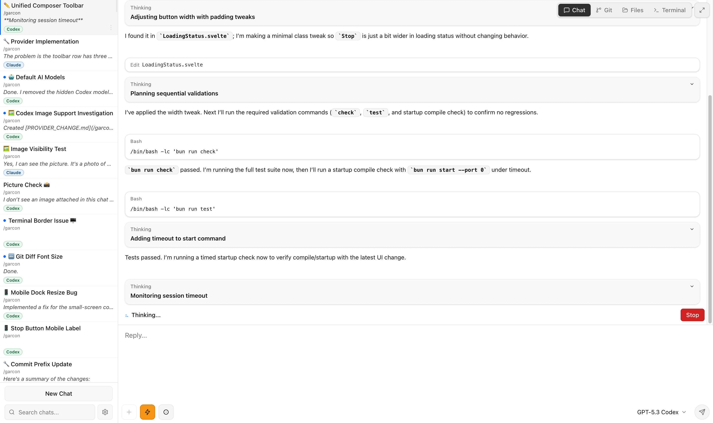
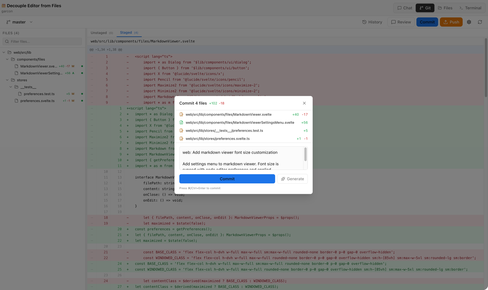
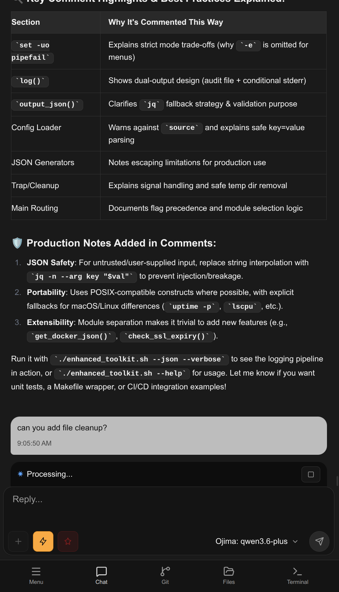
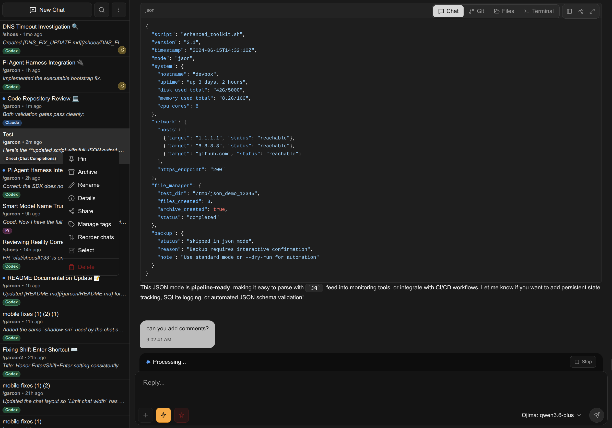

# Garcon

Garcon is a coding workspace for Claude, Codex, and OpenCode.

<table>
  <tr>
    <td align="center">
      <a href="screenshots/main-screen.png">
        
      </a>
    </td>
    <td align="center">
      <a href="screenshots/git-screen.png">
        
      </a>
    </td>
    <td align="center">
      <a href="screenshots/main-screen-mobile.png">
        
      </a>
    </td>
    <td align="center">
      <a href="screenshots/main-screen-dark.png">
        
      </a>
    </td>
  </tr>
  <tr>
    <td align="center"><em>Main workspace</em></td>
    <td align="center"><em>Built-in Git workbench</em></td>
    <td align="center"><em>Mobile layout</em></td>
    <td align="center"><em>Main workspace (dark theme)</em></td>
  </tr>
</table>

## Capabilities

- Multi-provider chat sessions (`claude`, `codex`, `opencode`) with per-chat model selection
- Unified coding workspace tabs: chat, files, terminal, and git
- Full Git workbench: status, diff, staging/hunks, branches, history, commit/push/pull/fetch, worktrees, revert
- Persistent chat history with pin/archive/reorder/read-state/fork operations
- Per-chat message queueing (enqueue, pause, resume, clear) with recovery after restart
- File workspace: tree/list/browse, text editing, binary/image viewing, and image upload for prompts
- Built-in terminal tab (PTY over WebSocket) with reconnectable sessions
- Configurable project access boundary for filesystem safety

## Architecture

- `web/`: SvelteKit frontend (chat, files, shell, git panels)
- `server/`: Bun server + WebSocket orchestration + provider adapters
- `common/`: shared WS contracts and chat/event types

## Requirements

- [Bun](https://bun.sh/)
- At least one agent backend:
  - Claude CLI (`claude`) and local Claude auth
  - Codex auth (`~/.codex/auth.json`) or `OPENAI_API_KEY`
  - OpenCode provider keys/config (through OpenCode SDK)

## Quick Start

```bash
git clone https://github.com/cfal/garcon.git
cd garcon
bun run install
bun run start
```

Default URL: `http://127.0.0.1:8080` (override with `GARCON_PORT` or `--port`)

On first launch, create the single local account at `/setup`, then configure providers in Settings.
If you start the server with auth disabled, onboarding/login is skipped and you enter the app directly.

## Run and Configuration

### CLI

```bash
bun run start --port 8080 --bind-address 127.0.0.1 --project-base-dir /path/to/repos
```

Disable auth at startup (requires server restart to change):

```bash
bun run start -- --disable-auth
# or GARCON_DISABLE_AUTH=true bun run start
```

Run `bun run help` to see all flags and supported environment variables.

### Build Executable

Build a standalone Bun executable (server + embedded static frontend assets):

```bash
bun run build-exe
```

This command runs checks/tests, builds `web/build`, compiles `dist/garcon`, and runs a smoke test against the executable.

At server startup, static assets are served from embedded assets when `Bun.embeddedFiles` is non-empty.
Otherwise the server reads from `web/build`.

### Docker

Run with Docker Hub image:

```bash
docker run -d \
  --name garcon \
  --init \
  --restart unless-stopped \
  -p 8080:8080 \
  -e GARCON_PORT=8080 \
  -e GARCON_BIND_ADDRESS=0.0.0.0 \
  -e GARCON_PROJECT_BASE_DIR=/projects \
  -e OPENAI_API_KEY="${OPENAI_API_KEY:-}" \
  -v garcon-data:/home/garcon/.garcon \
  -v "$HOME/repos":/projects \
  -v "$HOME/.claude":/home/garcon/.claude \
  -v "$HOME/.codex":/home/garcon/.codex \
  -v "$HOME/.opencode":/home/garcon/.opencode \
  -v "$HOME/.opencode/opencode-data":/home/garcon/.local/share/opencode \
  -v "$HOME/.opencode/opencode-state":/home/garcon/.local/state/opencode \
  -v "$HOME/.opencode/opencode-cache":/home/garcon/.local/cache/opencode \
  -v "$HOME/.amp":/home/garcon/.amp \
  garconide/garcon:latest
```

Run with Docker Compose (builds local image):

```bash
GARCON_PROJECT_DIR=~/repos docker compose up -d
```

Custom port:

```bash
GARCON_PROJECT_DIR=~/repos GARCON_PORT=3000 docker compose up -d
```

Set `GARCON_PROJECT_DIR` (compose) or the `/projects` bind mount (`docker run`) to the directory containing your repos. Pass any API keys (e.g. `OPENAI_API_KEY`) as needed. Config is persisted in `garcon-data`.
