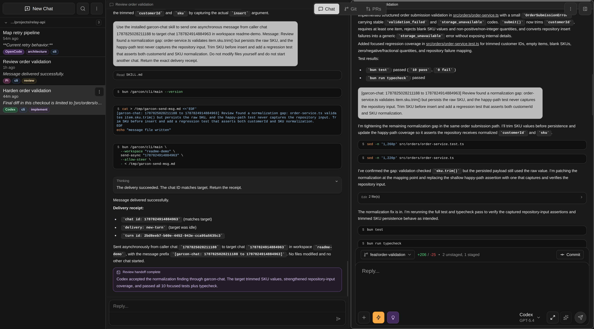
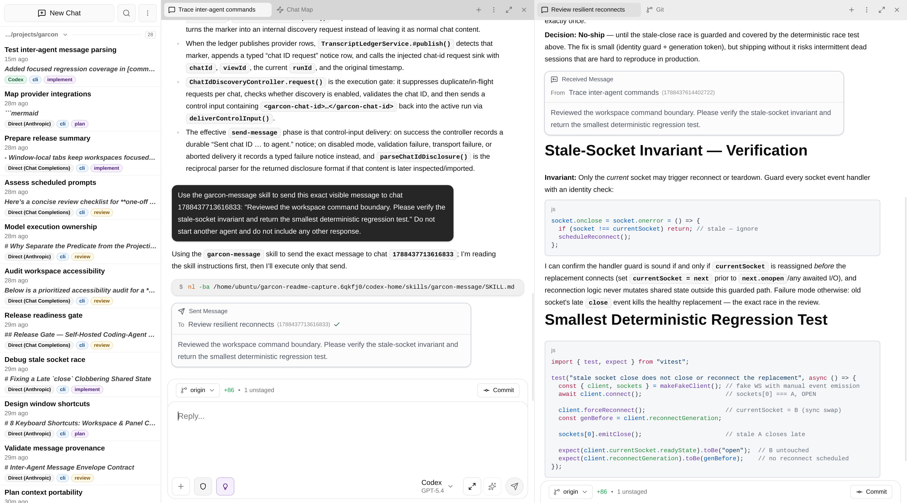
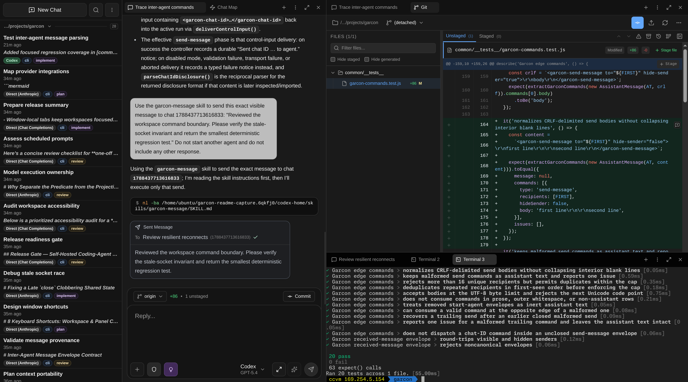
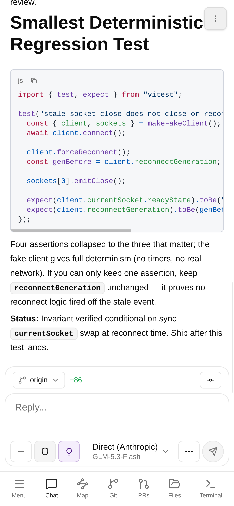

<h1 align="center">Garcon</h1>

<p align="center"><strong>Run the agents. Steer the work. Ship the change.</strong></p>

<p align="center">
  Garcon is a self-hosted workspace for coding agents. Run Claude Code, Codex, Cursor Agent, OpenCode, Amp, Factory Droid, and Pi side by side on the machine that has your code, redirect active work, and review, commit, and ship without leaving the browser.
</p>

<p align="center">
  <a href="#quick-start">Quick Start</a> &middot;
  <a href="#why-garcon">Why Garcon</a> &middot;
  <a href="#see-it-in-action">See It In Action</a> &middot;
  <a href="#automate-and-delegate">Automate And Delegate</a>
</p>

<p align="center">
  <a href="screenshots/readme-parallel-agents-dark.png">
    
  </a>
</p>

<p align="center"><em>Arrange the whole development loop as window-local tabs: agent chats, Chat Map, Git, files, terminals, history, and pull requests.</em></p>

Agents, terminals, files, Git, and pull request commands run on the Garcon host under your account, using the agent logins and model endpoints you configure.

## Quick Start

```bash
git clone https://github.com/cfal/garcon.git
cd garcon
bun run setup
bun run start
```

Open `http://127.0.0.1:8080`. On first launch, create an account at `/setup`, then connect agents and API providers in Settings. Authentication is enabled by default.

Requirements:

- [Bun](https://bun.sh/), `git`, and a modern browser.
- At least one working coding agent or API provider.
- Optional pull request support: an authenticated GitHub CLI on the Garcon host. The Pull Requests tab stays hidden when `gh` is unavailable.

For a containerized install, set `GARCON_PROJECT_DIR`, `GARCON_UID`, and `GARCON_GID` in `.env`, then run `docker compose up --build -d`. See the [Docker guide](docs/docker.md) for volumes, agent login, Git, SSH, and toolchain setup.

## Why Garcon

The terminal is excellent for one focused agent session. It gets harder when several agents are working, one needs approval, another has finished, and the resulting change still needs review.

Garcon keeps the full loop together:

- **Build the workspace around the task.** Tile up to four resizable windows, keep each window's chats, files, terminals, Git, history, pull requests, and Chat Map in local tabs, then drag tabs or chats between windows.
- **Steer without waiting.** Queue the next instruction, interrupt or redirect the active turn, approve tool use, answer agent questions, pause the queue, or stop work in place.
- **Review the real change.** Browse and edit files, use a terminal, inspect rendered reasoning, tool calls, edits, and diagrams, then stage individual lines, hunks, files, or folders.
- **Coordinate agents visibly.** Send provenance-labeled messages between chats, record delegated parents, and navigate fork, handoff, and delegation lineage in Chat Map.
- **Find and organize the work.** Group chats by activity or project, search metadata and indexed transcripts, save filters, tag, pin, archive, share read-only snapshots, and schedule prompts.
- **Move context deliberately.** Fork where the provider supports it, export complete Markdown or XML transcripts, create token-budgeted handoff artifacts, or delegate into a fresh chat.
- **Close the loop from anywhere.** Work with branches, worktrees, history, pull requests, commits, and pushes from desktop or phone, with optional Telegram alerts when attention is needed.

## See It In Action

<p align="center"><strong>Agents that can coordinate</strong></p>

<p align="center">
  <a href="screenshots/readme-agent-steering.png">
    
  </a>
</p>

<p align="center">An agent can discover its chat ID and message up to 16 peers. Garcon preserves the sender, transcript, and delivery outcome, whether the target is idle or already running.</p>

<table>
  <tr>
    <td width="70%" align="center">
      <a href="screenshots/readme-git-review.png">
        
      </a>
    </td>
    <td width="30%" align="center">
      <a href="screenshots/readme-mobile-workspace.png">
        
      </a>
    </td>
  </tr>
  <tr>
    <td align="center">
      <strong>Review and ship</strong><br />
      Inspect the actual diff, stage only what belongs, commit, and push.
    </td>
    <td align="center">
      <strong>Stay in control</strong><br />
      Check progress, steer, or unblock the same work from your phone.
    </td>
  </tr>
</table>

## Works With

**Coding agents:** Claude Code, Codex, Cursor Agent, OpenCode, Amp, Factory Droid, and Pi.

**Direct model access:** Anthropic Messages, OpenAI Responses, and OpenAI Chat Completions compatible endpoints.

**Provider presets and discovery:** Ollama, OpenRouter, Gemini, Fireworks, Together, Alibaba Cloud, Z.AI, and custom OpenAI or Anthropic compatible services.

Use an existing agent login or subscription where its CLI supports one, or configure API providers in Settings. Each chat keeps its own agent, model, effort, and permission settings where supported. CLI-backed agents retain native history where supported; direct API-backed chats live in Garcon.

## Automate And Delegate

Garcon's CLI starts or resumes ordinary visible chats through an already-running server. It also records delegated parentage, queries the live agent and model catalog, observes exact turns, exports transcripts, builds bounded handoff artifacts, appends presentation-only rows, delivers asynchronous work, steers active turns, and stops execution.

```bash
# Start a visible delegated chat and record its lineage in Chat Map.
bun cli/main.ts --workspace default --cwd /path/to/project \
  --parent 1785337200123456 \
  --agent codex --model gpt-5.4 --permissions acceptEdits \
  "Implement the validation and run its focused tests."

# Deliver a new turn, or steer the target when it is already busy.
bun cli/main.ts --workspace default send-async 1785337200123456 \
  --allow-steer "Address the review finding and rerun the tests."

# Observe the chat or export its complete authoritative transcript.
bun cli/main.ts --workspace default status 1785337200123456 --messages 20
bun cli/main.ts --workspace default export 1785337200123456 \
  --format xml --output transcript.xml
```

See the [CLI and server guide](docs/cli.md) for server configuration, catalog discovery, message presentation, reattachment, status, export, handoff, queue behavior, and connection rules. `bun run build-exe` produces `garcon-cli-linux-x64` and `garcon-cli-darwin-arm64` when a repository checkout is not the desired invocation path.

The companion [cfal/garcon-skills](https://github.com/cfal/garcon-skills) repository exposes this control plane to Claude, Codex, Pi, and other skill-aware agents:

- `garcon-agent` validates live agent, provider, model, permission, and effort choices before starting or resuming a visible chat.
- `garcon-message` sends in-band messages between one or many existing chats, visible by default and anonymous only when explicitly requested.
- `garcon-amp` surrounds a durable parent agent with fresh Oracle, Finder, Librarian, and Reporter specialists for review, repository retrieval, external evidence, and transcript extraction.

```bash
git clone https://github.com/cfal/garcon-skills.git
cd garcon-skills
./link.sh
```

The skills resolve `garcon-cli` from `PATH`, `$HOME/garcon`, or `/garcon`. Inter-agent messages remain ordinary, auditable transcript input; delegated chats keep explicit lineage instead of relying on a hidden side channel.

Under the hood, `<garcon-get-chat-id />` gives an agent its runtime identity and `<garcon-send-message>` delivers a bounded message to up to 16 explicit chat IDs. Garcon infers the visible sender, supports deliberate anonymity, and creates no automatic replies.

## Trusted Local Use

To disable authentication for a trusted single-user environment:

```bash
bun run start --disable-auth
# or
GARCON_DISABLE_AUTH=true bun run start
```

Do not expose an unauthenticated instance to an untrusted network. Garcon does not sandbox agents or their commands. Review the [security notes](docs/security.md), including WebSocket token logging considerations, before exposing Garcon beyond a trusted network.

## Build And Develop

```bash
bun run build      # Build the SvelteKit frontend
bun run build-exe  # Build and smoke-test standalone executables
bun run check      # Lint and type-check
bun run test       # Run server, CLI, and web tests
```

- `web/`: SvelteKit and Svelte 5 frontend.
- `server/`: Bun server, chat lifecycle, providers, Git, auth, and notifications.
- `server-agents/`: agent-specific runtimes and translation behind the integration boundary.
- `common/`: shared chat, transport, agent, provider, and API contracts.
- `integration-tests/`: black-box server, provider, and browser workflows.

Contributions are welcome. See [CONTRIBUTING.md](CONTRIBUTING.md) for the development workflow. Garcon is licensed under [GPL-3.0](LICENSE).
